# DDoS

拒绝服务攻击DoS **Denial-of-Service Attack:**

单一的DoS攻击一般是采用一对一方式的，它利用网络协议和操作系统的一些缺陷，采用欺骗和伪装的策略来进行网络攻击，使网站服务器充斥大量要求回复的信息，消耗网络带宽或系统资源，导致网络或系统不胜负荷以至于瘫痪而停止提供正常的网络服务。

**阻塞那个被控制的源，就可以解决DoS攻击**

但是DDoS  **Distributed Denial-of-Service Attack**

使计算机在同一时间遭受到来自很多宿主机的攻击，使攻击的目标无法正常使用

指处于不同位置的多个攻击者同时向一个或数个目标发动攻击，或者一个攻击者控制了位于不同位置的多台机器并利用这些机器对受害者同时实施攻击。由于攻击的发出点是分布在不同地方的，这类攻击称为分布式拒绝服务攻击，其中的攻击者可以有多个

## 对称的DDoS攻击 symmetric

### Ping Flood

利用网络层协议，Internet控制消息协议(ICMP)，用于网络设备之间的通信，也可用于网络诊断工具，如traceroute和ping;

ICMP Echo Request:发送方到接收方

ICMP Echo Reply:接收方到发送方

请求和回复都会消耗带宽，所以攻击者给server发送很多请求，server需要回复很多reply，就消耗了很多带宽

- 发一个**源地址为server**的广播Ping，然后子网内的所有主机都会对server回复一个reply

### TCP SYN Flood

利用handshake，server需要存储SN~c~和SN~s~

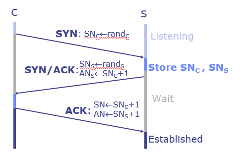

SYN使用一个队列存储，每当收到一个握手请求，就往队列里放一个SYN，如果很多握手请求，那就会队列溢出。（收到客户端的ACK之后把SYN队列出队一个，放到Accept队列里）

所以攻击者只要一直发SYN，不发ACK就可以让server队列溢出

但是server会有一个timeout的操作（太久没收到ACK就把请求取消掉），所以要在timeout的那个临界点再发足以塞满队列的请求

- 一个例子
- 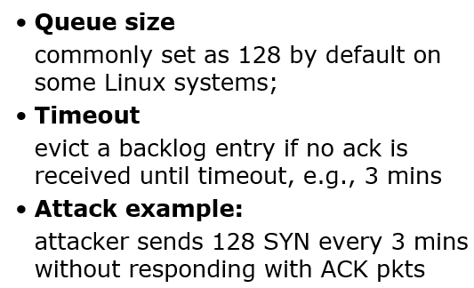

#### 防御TCP SYN

**SYN cookie**

在TCP服务器收到TCP SYN包并返回TCP SYN+ACK包时，不分配一个专门的数据区，而是根据这个SYN包计算出一个cookie值。在收到TCP ACK包时，TCP服务器再根据那个cookie值检查这个TCP ACK包的合法性。如果合法，再分配专门的数据区进行处理未来的TCP连接。

**把存储空间的消耗转变为计算时间的消耗**

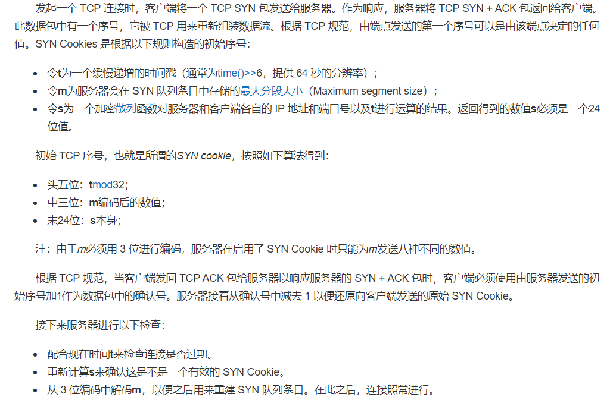

**TCP SYN Flood Backscatter**

给源地址发送SYN和ACK（**这个发送过去的SYN和ACK被称为backscatter**），如果多个源主机都没有给出回复，那么就可以检测到自己受到了DDoS攻击

目前讨论的都是**对称的DDoS攻击**，攻击者想要达到攻击效果，也要使用等价的资源

## 非对称的DDoS攻击

攻击者消耗的资源比受害者受到的攻击少很多

### **Smurf Attack**

**用广播地址作为目标地址**，**用受害者地址作为源地址**，使得路由器和防火墙将消息转发到自己的局域网，局域网内的PC发送reply给受害者。

用1个request来得到多个reply

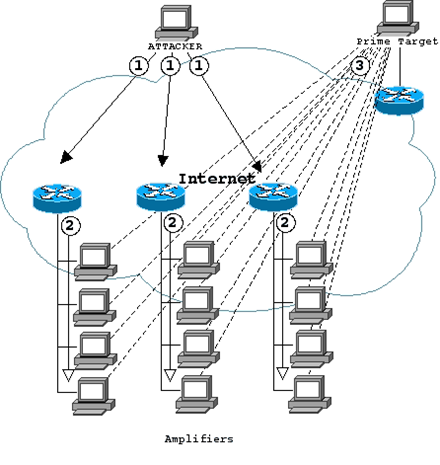

solution:

- 把广播ban了
  - 正常功能会废掉
- 让路由设备检测是否为伪造地址
  - **通过判断源ip（伪造的那个）是否在当前子网下**
  - 很难检查，会引入很大的开销

### **DNS Amplification Attack**

利用open DNS resolver（网络上的任何人都可以使用）

域名对应很多东西，不止是IP地址

使用ANY type查询DNS服务器，可以将这些信息全都返回

攻击者伪造源IP地址为受害者，向open DNS server发送ANY type的请求，受害者会收到远超于request的信息

solution

- 减少open DNS server的数量
- 检测源IP地址的正确性

### **NTP Amplification Attack**

NTP 网络时间协议

monlist命令的作用是返回最近浏览的600个IP地址

攻击者伪造源IP地址为受害者，使用monlist命令，让受害者收到600个IP地址的包

### **Memcached Attack**

攻击者预加载很多数据到Memcached sever，(确保让server传给受害者的数据存在于memcached中)

然后伪造源IP地址为受害者，使用memcached request，会返回一大堆数据给受害者

服务器通过UDP给受害者发送一大堆信息（不需要事先握手所以可以引发DDoS）

solution

- 把memcached server的UDP ban了
- 把memcached server置于防火墙保护中
- 检测或者过滤伪造IP

### SSDP Attack

Simple Service Discovery Protocol

利用通用即插即用(Universal Plug and Play, UPnP)网络协议，该协议触发通用即插即用设备，以响应它必须提供的所有服务的完整列表（一大堆信息）

attacker扫描upnp devices； 然后对可扫描到的upnp devices发特定request； 这个特定request激发upnp devices回复消息，此消息包括这个设备所支持的服务（一大堆） 以达到通过一个request激发大量信息的效果

solution是把UDP 在1900端口上的接收ban掉

## 计算不对称

### SSL/TLS Flood

handshake的过程很复杂，会有一大堆通信，占用服务器大量资源

SSL Flood或SSL Renegotiation attack利用了在服务器端协商安全TLS连接所需的处理能力。它要么**向服务器发送大量的垃圾数据**，要么**不断请求重新协商连接**，从而使服务器的资源超出其限制并使其离线。

**RSA 加密的速度是解密的十倍，所以一台PC 能把十多台服务器拖垮**

==正常流程是client加密消息后发送给server，然后server用大量资源进行解密==

==攻击者可以控制大量bot，不经过加密直接按照格式发送大量乱码，会导致受害者server消耗大量资源==

### HTTP Flood

#### GET attack

多台设备向server请求大图片或者大文件，（server要用资源来加密，同时还会占用带宽）让server来不及响应正常的请求

#### POST attack

当表单在网站上提交时，服务器必须处理传入的请求并将数据推送到数据库中。与发送POST请求所需的处理能力和带宽相比，处理表单数据和运行必要的数据库命令的过程是相对密集的。这种攻击利用相对资源消耗的差异，通过直接向目标服务器发送许多post请求，直到其容量饱和并发生拒绝服务。

solution

- 限制大文件的请求

### Fragmented HTTP Flood (片段化的)

用有效IP的bot与服务器建立HTTP连接，然后在超时之前尽可能慢地发送包给server

这种方法允许攻击者长时间保持连接处于活动状态，而不向任何防御机制发出警报。攻击者可以使用一个BOT发起多个未被检测到的、扩展的、消耗资源的会话，使得server的资源最终被消耗殆尽。

### Payment DDoS (是DDoS的一个攻击例子)

攻击者控制多个傀儡机，每个傀儡机对于受害服务器的终端进行一些小带宽的请求。这些请求汇聚到服务端，即组成一个很大带宽的请求

### 从内部最薄弱环节攻击-Tail Attack

对于n层的网络应用，识别出最薄弱的连接，对其进行攻击

对于A，一批请求不会导致拥塞；但是对于处理能力较差的B，这些请求就会导致拥塞。所以A和B组成的这个系统就被拥塞了。

### 从外部最薄弱环节攻击-SDN CrossPath Attack

通过共享链接中断SDN控制通道．不直接攻击SDN控制器．相反，使用攻击流量来阻止控制消息

SDN: Software-Defined Networking

- 独立的控制和数据平面
- 集中的网络控制
- 使网络可编程

SDN controller 通过 Control Channels:

- 交付所有控制流量;

- 从控制器到交换机发布规则;

- 报告从交换机到控制器的统计数据;
- 保证安全可靠;
- 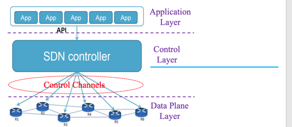

在每一个switch和SDN controller之间都要有直接的links，这限制了SDN controller的延展性

- 所以可以通过data path转发控制流量（将control信号和data一起传输），使用shared links减少直接连接
- 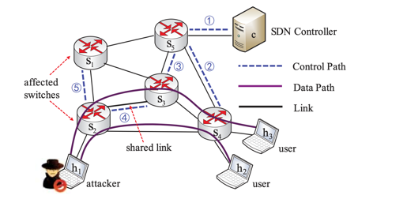
- 于是攻击者可以通过攻击shared link共享链接(比如发很多没用的数据)，把shared link拥塞，淹没控制信号，中断SDN控制通道

## DDoS defenses

- 增加服务器被攻击的难度
  - 丰富服务器资源
  - 利用他人的资源
    - Google Project Shield

- 使服务器更难被攻击
  - 检测过滤攻击流量与伪造IP地址
    - Ingress Filtering 
    - Traceback
    - Path Validation
    - Alibi Routing

- 让攻击者付出成本更高
  - client puzzles
  - CAPTCHA

### 增加服务器被攻击的难度

#### Google Project Shield

利用Google的超级大带宽和超完备基础设施来庇护脆弱的网站

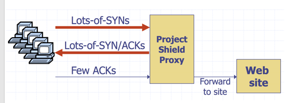

### 使服务器更难被攻击

#### **Ingress Filtering**  入口过滤

检测并过滤伪造IP地址的数据包

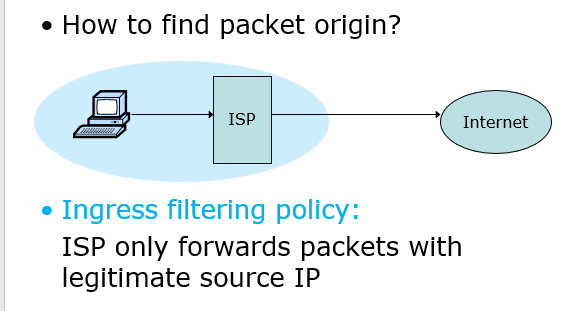

ISP（互联网服务提供商）只转发源IP合法的数据包

它通过在数据包进入网络时（**在流量的源头进行处理**），检查其所声称的源 IP 地址是否满足路由通告的网络前缀，如果不是，将其过滤掉。在**网络入口**处的路由器上实施这种过滤机制，对于阻止不符合进入规则的假冒 IP攻击非常有效。不过，对来自合法 IP地址前缀的假冒攻击将完全没有作用。

- 但是不好实现
  - 成本增加，效率降低
  - 因为所有的ISP都必须要部署这个防御机制，如果有10%的ISP没有部署，那么也是没有很好的防御效果的

#### Traceback

但如果ISP没有过滤掉伪造源IP地址的数据包，那么需要中间的转发路由器检测出来并且拦截

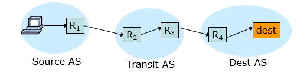

需要修改中间的路由转发设备（转送自治系统transit AS）的协议栈

最简单的方式：

- **记录每一次转发的路由器的IP地址**
- 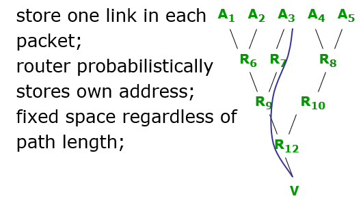
  - 这样就能让victim或者要被骗回reply的人知道数据包来自于哪里
  - 如果说实际的源头跟源IP地址是在同一个AS的管辖范围，那么基本上可以认为是合法的
    - 当然了，可能伪造的IP地址跟自己在同一个AS管辖内，那就看不出来，但是也能过滤掉不少
- 限制是
  - 数据包中需要空间
  - 路径可以很长
  - 当前IP格式中没有额外的字段(对包格式的更改太多了)

**采样记录：**是固定开销，每个包多一个s，一个e，一个d

（start是最后一次采样的路由器，e是采样后的下一个路由器，d是距离最后一次采样过了多久）

间歇性地记录经过的路由器的IP

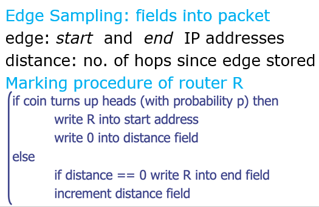

每个包只有部分的信息，但是多个包就会有大量的信息，用这些信息可以拼凑出整条路径上经过的路由器和他们离自己的距离，还原出这条路径

#### Path Validation

PoC: Proof of Consent - 证明网络提供商同意沿该路径传输流量

PoP: Proof of Provenance - 允许上游节点向下游节点证明他们携带了数据包

#### **Alibi Routing** 不在场证明

- 证明一个包没有经过一个区域

引入一个辅助结点，如果想要经过一个区域和这个点，那么不可能在一个规定的时间内到达。因此，如果时间没有超过limit，那么肯定没有经过某个区域，即不在场证明

## 让攻击者付出成本更高

#### **Client** **Puzzles** 

让客户端想要建立连接之前，需要经过一个比较复杂的计算（让攻击的发送者也消耗一些资源）

#### CAPTCHA

Completely Automated Public Turing test to tell Computers and Humans Apart

区分请求发送者是机器人还是人类

- 验证码
- 人机验证

可以顺便用于训练模型
