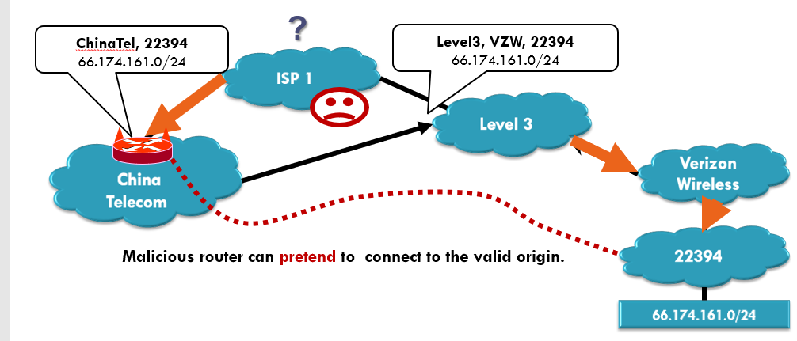

Routing

- distance-vector 
  - 距离向量法
  - 可能会有路由器声明自己对其他结点的距离为0，由此吸引流量

- link-state
  - 链路状态法
  - 攻击使得link断掉（drop）
  - 伪造一条到其他router的直连link，使流量绕过某路由器
- BGP
  - 伪造任意的前缀（最长前缀匹配原则，然后流量就被引导了）
  - 改变路径

## 攻击方式

### Prefix Hijacking

- 利用BGP协议，攻击者宣称伪造的IP前缀，（并不拥有但是claim自己有）改变流量的路由

  - YouTube的IP是208.65.153.0/22，一个电信被劫持，声明自己是208.65.153.0/24，那么访问YouTube的流量都被吸引到这个电信了
- 攻击者宣称自己和一个经常被访问的目的地直接相连，那么想要访问目的地的流量就不会走原先的路径，而去走攻击者所在的路
  - 中国电信声明自己与目的地直接相连，然后想要访问目的地的流量就都被吸引过来了

### **Path Tampering**

- 把某些AS从AS 路径中移走
- 把某些AS加入到AS路径中

改变AS路径，达到改变流量路由的目的

## 防护

### RPKI

Resource Public Key Infrastructure 

通过公钥对用户身份进行验证

但是并不充足

恶意的路由器可以伪造成自己与合法的来源相连

### S-BGP

安全BGP

对BGP要传输的消息进行加密后再传输

每一个AS（自治系统）都通过密码加密的方式签名它的每一条消息

保证没有AS会被恶意删掉或者被恶意加上，保证AS遍历的顺序

但是部署S-BGP很有困难

- 完整准确地注册不能很好的达到
- 公钥基础设施不完善
- 密码学操作耗时耗资源
- BGP对操作的效率要求较高
- 增设、改动部署困难

