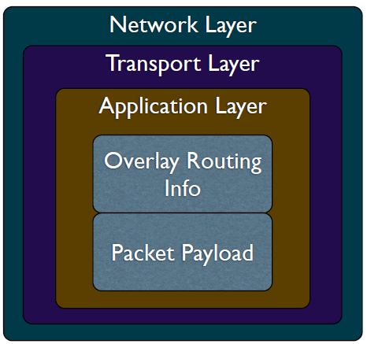
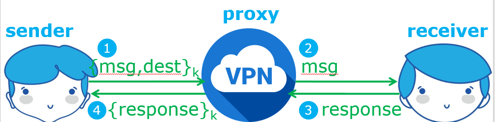
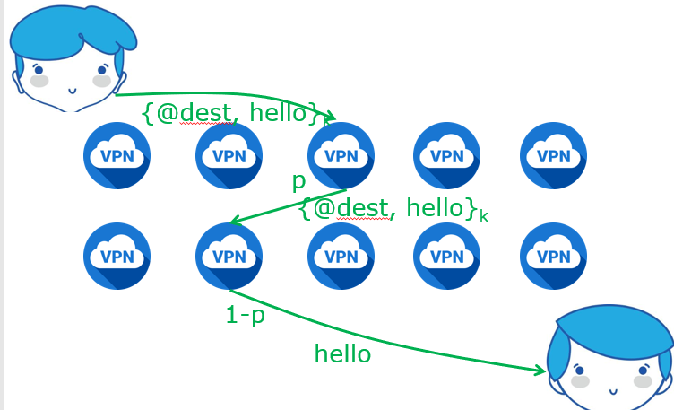
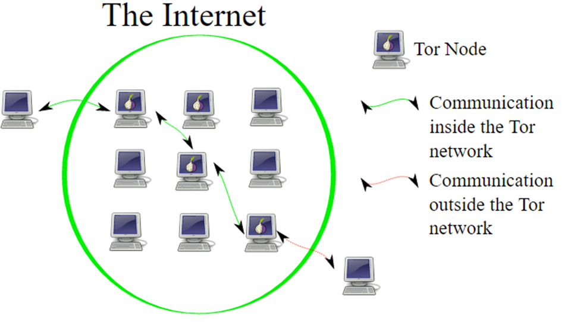
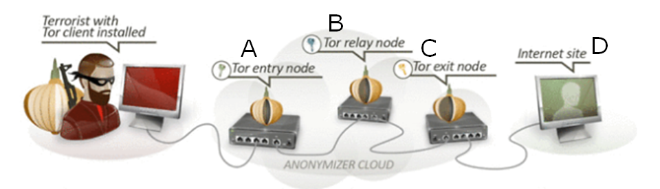
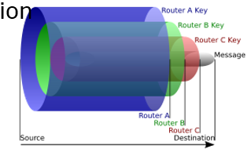
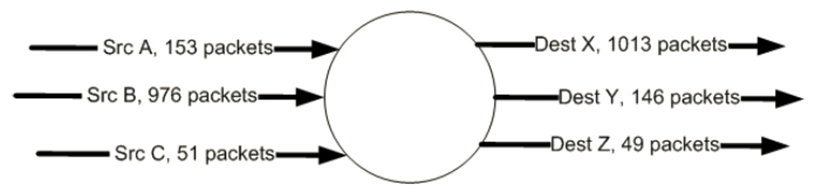

# Anonymous Commuincation

 经过加密传输信息，攻击者无法获得信息的具体内容，但是可以获得交互双方的IP地址

- 因为IP头的格式是基本固定的

HTTPS

- 在HTTP的基础上通过传输加密和身份认证保证了传输过程的安全性
- 在HTTP的基础上加入SSL

## relay

可以使用relay（转发，接力）的方式，需要trust一个第三方 **可信第三方**

- 第三方就只能看到IP1->IP3,IP3->IP2,但是不知道IP1->IP2
  - 将IP2的地址加密后作为Overlay Routing Info，跟packet payload一起传输，第三方拿到IP packet后解密然后转发
  - 第三方要保留这个转发过程的信息，这样IP2发回reply的时候第三方能将他转发给IP1
  - 

- 在relay node两侧的发送和接收结点数量较少的时候，容易被攻击者通过观察发送和接收数量，来推测发送者和接收者IP的关系
  - 可以将payload分拆，多次发送，混淆数量
  - 以各种角度添加噪音，发送一些噪声数据包

## Threat Model

攻击者是网络内的一部分

攻击者可以选择攻击或者不攻击

攻击者可能会对网络进行严密控制，但是不太可能监测整个互联网

### passive attacker

可以跟踪发送者的消息（若干跳），阻碍接收者的匿名性

### active attacker

标记message，在其他地方发现这个包

## Anonymizing Proxy

代理是第三方的一个实例

可以实现两种（攻击者无法得知发送者和接收者的对应关系）

1. 接收者不知道发送者是谁
   - 信息先用receiver的公钥加密得到msg，然后跟dest一起用sender和proxy约定的加密方法一起发送给proxy
   - proxy转发给receiver的信息按照receiver要求的方式传输
   - receiver拿自己的私钥解密msg
   - receiver按receiver的要求给出response
   - proxy用sender和proxy约定的加密方法加密后转发给sender
2. 接收者知道发送者是谁
   - 信息用sender和receiver的shared key加密得到msg，然后跟dest一起用sender和proxy约定的加密方法一起发送给proxy
   - proxy转发给receiver的信息按照receiver要求的方式传输
   - receiver拿shared key解密msg
   - receiver按receiver的要求给出response
   - proxy用sender和proxy约定的加密方法加密后转发给sender
     - 但是有一点不好，receiver需要遍历找到用的是哪个shared key

攻击者如果监控到1、4，那么sender没有匿名性，receiver有匿名性

攻击者如果监控到2、3，那么sender有匿名性，receiver没有匿名性

攻击者如果监控到1、2、3、4，那么sender和receiver都没有匿名性

如果proxy被攻击者攻克，那么sender和receiver都没有匿名性

### 更好地躲避攻击者

攻击者可能会监视sender到Proxy A和Proxy A 到receiver的信道

#### Crowds Aligorithm

使用更多的，更随机的proxy

可使用的proxy node被称为Jondos

p概率发送message给其他jondo，（1-p）概率发送给destination

sender和proxy之间使用他们约定的key1，proxy之间使用相互约定的key2（各不相同），最后一个proxy与sender之间使用key3

### 躲避untrusted proxies

- 可以增加proxy的数量
  - 数量大之后，恶意proxy的比例变小
- 允许发送方指定全部或部分的路由路径(**source routing**)
  - 相比之下，在传统的路由中，网络中的路由器是根据数据包的目的地动态地确定下一条路径的

### POF source routing 不经意转发

在数据包中指定路由器要转发的端口号

每个结点都知道了下一个要往哪个结点发

## onion routing

利用source routing和overlay network，onion路由中的路由器不是传统的路由器，他们只是抽象的节点

外部用户先连接到洋葱路由的服务器，然后在服务器的安排下发送给洋葱路由的一个结点A，A随机发送给B，B随机发送给C，C发送给dest

A知道源地址，C知道目标地址，B什么都不知道

对于每个结点来说，它不知道这个流量是来自于dest还是来自于中继节点，也不知道转出的流量是通往dest还是通往其他中继节点

**Layered Encryption**
先连接到一个中央服务器，中央服务器会分配3个节点，src可以直接联系3个中间节点，建立共享密钥，然后逐层加密 {{{{msg}~D~}~C~}~B~}~A~。在传输过程中会逐层解密。与D的密钥是用pk加密的，也可以使用Diffle-Hellman方法建key。

msg被层层包裹 {{{{msg}~D~}~C~}~B~}~A~

如果三个洋葱路由的节点相互交换信息，那么src和dest进行信息交流的事实就无法被掩盖

**洋葱路由为什么只使用3个节点？**

- 洋葱路由协议需要高效且安全：

  - 如果只用一个节点，若该节点是恶意的，则直接能发现。

  - 若两个节点，第一个节点知道src，第二个节点知道dest，若这两个交换信息则可以知道交流意图

  - 若有3个节点，则中间节点不知道src和dest，但是若他们合谋，就仍然等同于一个，交流意图还是会被知道。

### 洋葱协议的路径选择算法

每个结点自行报告带宽，服务器用加权算法计算每个结点的分配概率

攻击：恶意的结点会报告非常大的带宽来获得更大的被选择概率

- 如果第一个hop被控制，那么sender的隐私泄露
- 如果最后一个hop被控制，那么receiver的隐私泄露

### counting attack

将一个结点的输入数据包和输出数据包一同分析，由转发数量得到src和dest的关联性

### Low Latency Attack

tor node对于它所服务的每个用户维护一个queue，使用round-robin的方式依次服务每个用户，每次一个packet

用户要发送的packet进队，tor node转发一个packet就将那个队列中的packet出队

Attacker伪装成user，不断发packet，看延迟是否降低
