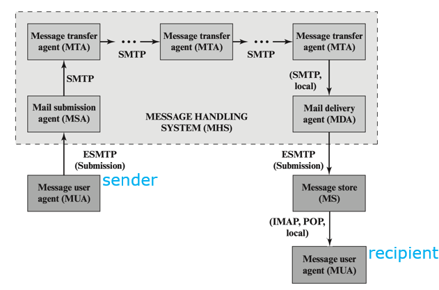
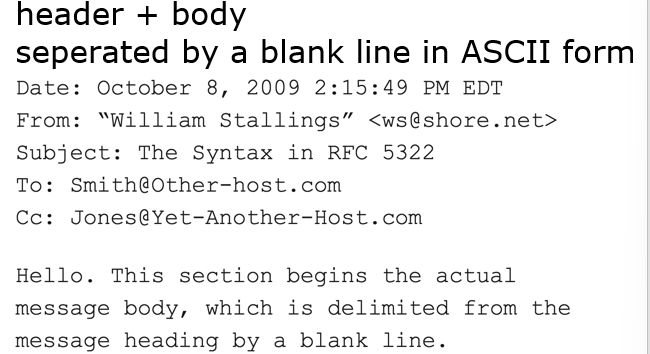
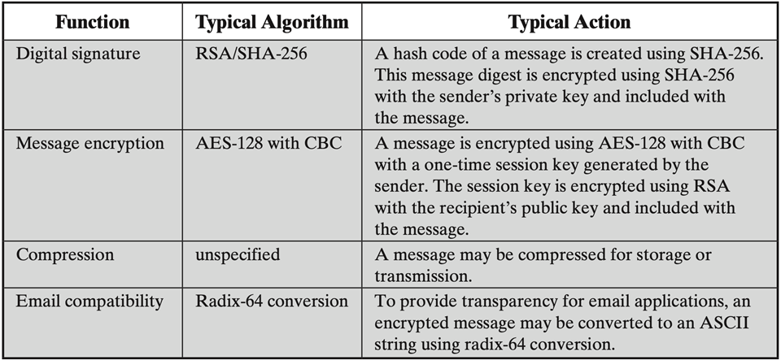
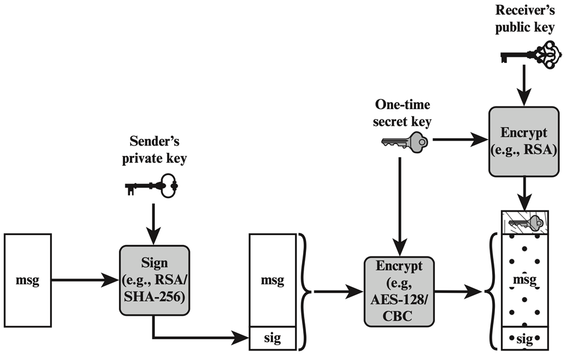
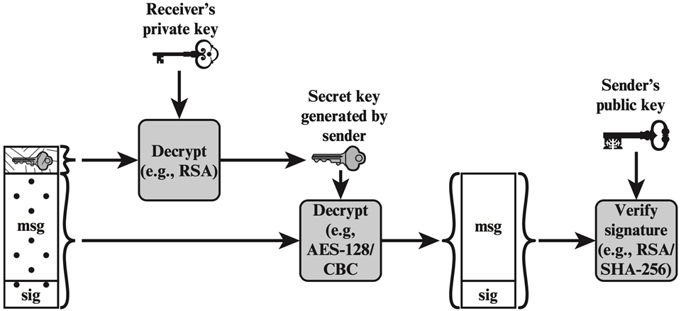
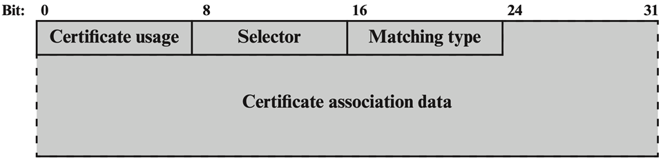
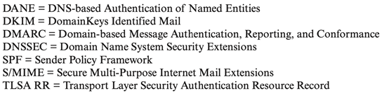
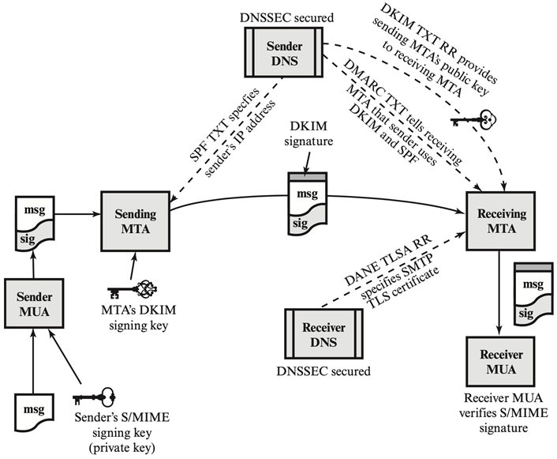

# E-mail Security

**MUA**    **Message User Agent**

- 托管在客户端电子邮件程序或本地网络电子邮件服务器上； 

- sender MUA 格式化消息并通过 MSA（邮件提交代理）向 MHS 执行初始提交； 

- recipient MUA 处理收到的电子邮件以存储和/或显示给收件人用户

**MHS   Message Handling Service**

- 由 MTA（消息传输代理）组成，入口是MSA，出口是MDA；
- 接受来自发件人的消息并将其传递给一个或多个收件人；
- 创建虚拟 MUA 到 MUA 环境；

### email协议

**有SMTP,IMAP,POP**

**SMTP   Simple Mail Transfer Protocol**

move messages through the Internet from source to destination

**IMAP  Internet Mail Access Protocol;**  **POP Post Office Protocol;**         收邮件时使用

transfer messages between mail servers

### Email Format

**RFC 5322**

messages分成envelope和contents

header fields会被用于创建envelope

**MIME **Multipurpose Internet Mail Extensions extend RFC 5322 with enhancements

之前只支持文本，使用MIME可以使用多媒体传输的编码格式

- 定义五个新的header fields来提供message content的信息
- 标准化支持多媒体电子邮件的表示
- 定义传输编码，允许将任何内容格式转换为不受邮件系统更改的形式

header包括(都是可选的，可能会被接收方忽略)

- MIME-Version
  - parameter value should be 1.0, indicating that the message conforms to RFCs 2045 and 2046
  
- Content-Type
  - 充分详细地描述正文中包含的数据，以便接收方代理可以选择适当的代理或机制来向接收方表示数据或以适当的方式处理数据
  
  - data：指inner MIME-encoded message content，可以封装为以下形式
  
    - SignedData
      - message的数字签名
  
    - EnvelopedData
      - 任何类型的加密数据，以及一个或多个收件人的加密内容加密密钥;
    - CompressedData
      - message的压缩数据
  
- Content-Transfer-Encoding
  - 指示用于表示消息正文的信息类型，对于邮件传输应该是可以接受的
  
- Cotent-ID
  - 在多个上下文中唯一标识 MIME 实体
  
- Content-Description
  - 带有正文的对象的文字描述； 当对象不可读时有用（例如，音频数据）

## Email Security Threats

### Authenticity-related Threats 真实性

- 导致对邮件系统的非认证访问，不合法用户访问

### Integrity-related Threats  完整性

- 导致对邮件系统的非授权修改

### Confidentiality-related Threats 保密性

- 会导致敏感信息的未经授权泄露

### Availability-related Threats  可用性

- 会阻止终端用户发送或接收电子邮件

## S/MIME Secure/Multipurpose Internet Mail Extension 

### 如何保证真实性  

**只保证发送者是不是真实的发送者**

1. 发送者创建message
2. 用SHA-256生成一个256bit的摘要
3. 用sender的私钥RSA加密摘要（签名），将签名和sender的身份信息附在message后
4. 接收者用sender的公钥RSA解密签名并且用SHA-256验证身份

### 如何保证保密性

只保证传输的message是不是不能被别人看到

1. 发送者创建message，随机生成一个128bit的数字作为这个message的一次性密钥
2. 用这个一次性密钥加密message
3. 用receiver的公钥加密一次性密钥，然后附在message后面
4. receiver用自己的私钥解密得到一次性密钥
5. 用一次性密钥解密message

### 同时保证真实性和保密性

sender:

1. the sender creates a message

2. use SHA-256 to generate a 256-bit message digest
3. encrypt the message digest with RSA using the sender’s private key;
4. append the result as well as the signer’s identity to the message
5. the sender creates a random 128-bit number as a content-encryption key for this message only
6. encrypt the message using the content-encryption key
7. encrypt the content-encryption key using the reciever's public key and put it before the message

reciever:

1. The receiver uses RSA with its private key to decrypt and recover the content-encryption key 
2. receiver uses sender's content-encryption key to decrypt and recover the message and signature
3. use sender's public key to verify signature

## PGP

pretty good privacy

与S/MIME的功能相同

### 与S/MIME的不同点

#### key certification

- S/MIME 使用 CA 或授权机构颁发的 X.509 证书； 

- OpenPGP 允许用户生成自己的 OpenPGP 公钥和私钥，然后向已知的个人或组织征求其公钥的签名

#### Key Distribution

- OpenPGP在message中不包含发送者的公钥，接收者需要自行从tls保护网站或OpenPGP公钥服务器领取

- 不会对OpenPGP密钥进行审查，用户自行决定是否相信sender

## CA被破坏时

- CA server的私钥被窃取，那么攻击者就可以伪造证书
- 单个CA的破坏会导致整个CA系统的完整性被破坏
- 被破坏的CA可以发布伪造的根证书，导致子域名也不可被信赖

### DANE

DNS-based Authentication of Named Entities

用于防止CA被破坏

使用DNSSEC（域名安全扩展），允许X.509颁布的证书跟DNS域名绑定在一起

DANE 的目的是用对 DNSSEC 提供的安全性的依赖来代替对 CA 系统安全性的依赖。 鉴于域名的 DNS 管理员有权提供有关区域的识别信息，因此允许该管理员还可以在域名和可能由该域名的主机使用的证书之间进行权威绑定是有意义的 .

#### TLSA Record

TLS Authentication record   TLS 认证记录      

TLSA是DANE 定义的新 DNS 记录类型，用于验证 SSL/TLS 证书的安全方法

TLSA指定哪些 CA 可以担保证书，或哪些特定 PKIX [公钥基础设施 (X.509)] 最终实体证书是合法的
TLSA指定服务证书或 CA 可以直接在域名系统中被认证

- Certificate Usage
  - 定义了四种不同的用法模式，满足需要不同认证格式的用户的需求
  - PKIX-TA (CA constraint):
    - 指定应该信任哪个 CA 来验证服务的证书
    - 基于公钥认证体系PKIX，基于CA
  - PKIX-EE (service certificate constraint):
    - 定义服务应该信任哪个特定的终端实体服务证书
    - 基于公钥认证体系PKIX，基于证书
  - DANE-TA (trust anchor assertion)
    - 所使用的证书具有指向该记录中提到的证书的有效证书路径，但是不需要将PKIX证书路径验证传递给受信任的根CA。
    - 基于DANE，基于CA
  - DANE-EE (domain-issued certificate)
    - 服务使用自签名证书。它没有任何其他人签名，并且正是此记录
    - 基于DANE，基于一个具体的TLS证书

- Selector
  - 指定是否整个证书会被匹配还是只匹配证书的值
- Matching Type
  - 指明证书的匹配方式
    - 严格match
    - SHA-256 hash match
    - SHA-512 hash match
- Certificate Association Data
  - 证书data的十六进制形式

### DANE for SMTP

漏洞：

1. 攻击者可以破坏信号，剥离 TLS 能力并将连接降级为不使用 TLS； 
2. TLS 连接通常未经身份验证（例如，使用自签名证书以及不匹配的证书很常见）

DANE起到的作用：

1. domain将TLSA的存在作为必须执行加密的指示，从而防止攻击者的恶意降级
2. domain可以使用DNSSEC签名的TLSA对TLS连接设置中使用的证书进行身份验证

### DANE for S/MIME

将证书和DNS domain name关联起来

帮助MUA处理邮件正文中电子邮件地址中指定的域名（相对应地，TLSA处理邮件envelop中的域名）

## 解决IP spoofing

主机可以伪造任意的domain name放在header里

### SPF

Sender Policy Framework       

 ADMD（Administrative Management Domains）在 DNS 中发布 SPF record，指定允许哪些主机/IP地址使用其名称(域名)； 收件人使用已发布的 SPF record来测试在邮件传输期间使用给定“HELO”或“MAIL FROM”身份发送邮件传输代理 (MTA) 的授权；

### DKIM

Domainkeys Identified Mail

sender用email来源的管理域的私钥对message进行签名

receiver**通过DNS服务器**拿到email header中的域的公钥，验证签名是否合法

S/MIME和PGP是用sender的私钥签名，DKIM是用**sender所在域**的私钥签名

## Email is exploited

电子邮件被利用

### spam

垃圾邮件

### phishing

钓鱼邮件，攻击者伪造一些很像正经网站的网址

### Malware

恶意病毒，一般使用附件的形式隐藏

