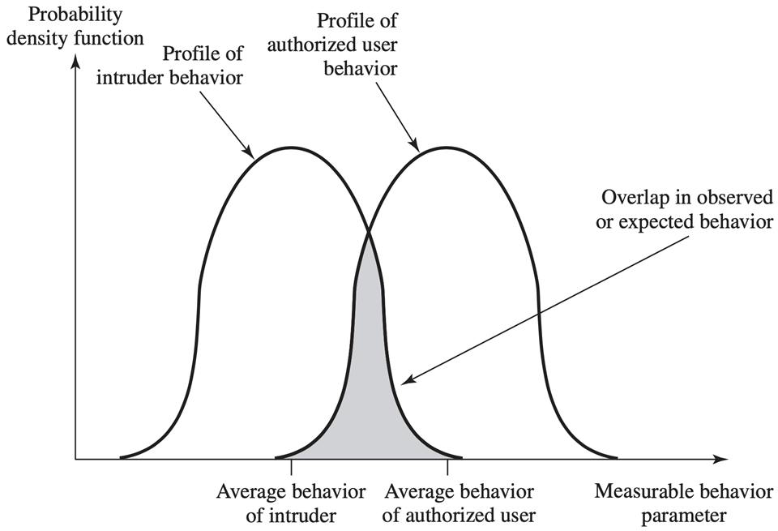

# Traffic Anaylsis

过滤恶意流量

使用防火墙安全策略来指定哪些流量被授权能否在某个方向上通过

内部(保护)网络(例如,企业网络)----防火墙-----外部网络(不可信)(如互联网)

从内到外和从外到内的流量都需要经过防火墙

只有经过安全策略认证的流量才能通过

防火墙本身需要是不受渗透的

## 防火墙使用的策略

### Service Control

determine service types that can be accessed, inbound or outbound

确定可访问的服务类型(入站或出站)

- 根据IP地址、协议或端口号对流量进行过滤
- 提供代理软件，在**传递服务请求之前接收并解释**每个服务请求
- 托管服务器软件本身，例如Web或Email service

### Direction Control

determine the direction in which particular service requests may be initiated and allowed to flow through the firewall

确定特定服务请求可以启动并允许流过防火墙的**方向**

需要对服务有一定的了解，以此确定方向

### User Control

control access to a service according to which user is attempting to access it

根据尝试访问服务的用户来控制对服务的访问

通常适用于本地用户
也通过安全认证技术（例如，IPsec Authentication Header）应用于外部用户

### Behavior Control

control how particular services are used

控制如何使用特定服务

例如，过滤电子邮件以消除垃圾邮件，或允许外部访问本地Web服务器上的部分信息

## 防火墙的类型

### packet filtering firewall 包过滤

最常用

**在单个数据包的基础上做出过滤决策，不考虑更高层次的上下文**（状态）

检查每个经过防火墙的packet，根据特定的规则，对其进行丢弃或转发

规则的示例：

一般使用packet header field中的元素进行检查，在规则表项中寻找匹配项

- 源地址
  - 一般而言，由于来源IP不易阻挡，通常借由阻挡非80/443的端口，以阻挡来自非80/443的端口的不需要的流量
- 目标地址
- 协议
  - 例如拒绝接受加密数据包

在没有匹配项的情况下，有两种默认策略：默认丢弃和默认转发

- 缺省情况下，**丢弃策略较为保守**。最初，一切都被阻止，服务必须在具体情况的基础上添加。用户更容易看到这个策略，他们更可能将防火墙视为一个障碍。然而，这一政策很可能受到企业和政府机构的青睐。此外，随着规则的创建，对用户的可见性会降低。

- **默认转发策略**增加了终端用户使用的**便利性**，但**降低了安全性**；本质上，安全管理员必须对已知的每一个新的安全威胁作出反应。这个策略通常可以被更开放的组织使用，例如大学。

实际使用时，对于第一次接收到的packet，防火墙并不能识别出他是恶意的还是合法的

**所以一般使用默认丢弃策略**

防火墙的parse需要一定的时间，还没被parse的包被维护在一个queue中。如果规则中只对某些field有要求，那么实际上只需要parse那些field的值就可以决定是转发还是丢弃，这样可以提高效率

处理一个包的时间决定于：

- 防火墙parse这些field字段的顺序
- 防火墙匹配规则的顺序

只使用单个包检测的话，可能出现的问题：

- 有些攻击使用多个包协同操作，只根据单个包判断并不能拦截恶意攻击
- 比如DDoS攻击，使用多个正常的通信包导致服务器服务瘫痪
  - TCP SYN Flood攻击者控制多个bot给server发送建立连接的请求，导致server overload
  - 这种情况就不会被防火墙检测出来

### stateful inspection firewall 状态检测

TCP SYN Flood可以由此检测出来

状态检测防火墙在网络层有一个检查引擎截获数据包并抽取出与应用层状态有关的信息。

本地记录一些可能跟恶意行为或合法行为相关的状态信息，并以此为依据决定对该连接是接收还是拒绝

- 比如某个用户累计的流量，当流量过大的时候可以推测出该用户受到了ddos攻击

packets和他们的上下文（状态）都会被防火墙检查

但是有可能会误判然后阻碍内部用户收到外部的正常请求

### application proxy firewall 应用代理

应用层的网关，充当应用程序级流量（application-level traffic）的中继。

这种防火墙通过一种代理（Proxy）技术参与到一个TCP连接的全过程。从内部发出的数据包经过这样的防火墙处理后，就好像是源于防火墙外部网卡一样，从而可以达到隐藏内部网结构的作用。

起到了类似于NAT的作用，内部的流量被统一转化为外部的统一接口，需要维护一个转化的对应关系。

### circuit-level proxy firewall 电路级代理

充当 TCP 段的中继而**不检查内容**

用于保证TCP和UDP数据包的安全传输，以及用来监控受信任的客户或服务器与不受信任的主机间的TCP握手信息，保证建立的连接的合法性

电路级网关是在OSI模型中**会话层**上来过滤数据包

### 使用防火墙的位置

#### DMZ Networks

DeMilitarized Zone是为了解决安装防火墙后外部网络的访问用户不能访问内部网络服务器的问题，而设立的一个**非安全系统与安全系统之间的缓冲区**。

该缓冲区位于企业内部网络和外部网络之间的小网络区域内。在这个小网络区域内可以放置一些**必须公开的服务器设施**，如企业Web服务器、FTP服务器和论坛等。另一方面，通过这样一个DMZ区域，更加有效地保护了内部网络。因为这种网络部署，比起一般的防火墙方案，对来自外网的攻击者来说又多了一道关卡。

**外部防火墙**：为DMZ系统提供访问控制和保护，以满足其外部连接的需求

**内部防火墙**：增加了更严格的过滤能力；保护内部网络免受DMZ的攻击，保护DMZ免受内部网络的攻击；保护内部网络彼此不受影响；

正常流程是需要先通过external firewall转发到DMZ network中的前端服务器，然后被他们处理的流量转发到Internal firewall，然后Internal firewall检测通过后再转发到protected network中的数据库等后端服务器进行处理。

如果external firewall和internal firewall合并，即只在最外层使用一个firewall，将各种规则都合并到这个防火墙上。他不好：

- 因为可能在包的开始不会显现出威胁（比如TCP SYN Flood），只有在前端服务器处理之后才可能检测出一些包所具有的危险迹象、通信模式，因此要在前端服务器（DMZ中）处理之后再经过一道防火墙，再进入后端服务器。
- 所以如果要合并的话就得，先通过firewall，前端服务器处理，将这个包带上一些状态信息，再回去通过那个firewall，再进入内部后端，非常的冗余，且第一步的firewall不需要那么高级的功能
- 以及防火墙需要对每一个数据包本身进行状态区分，识别出该流量是第一次进来还是处理过的，要比内外两个复杂很多。

#### Virtual Private Networks

在较低的协议层中使用加密和身份验证，通过不安全的互联网提供安全连接

比使用专用线路的真正专用网络更便宜

常用协议：IPsec

由使用IPsec的防火墙保证packet是来自于内部的网络，以此确保安全

VPN的基本处理过程如下：

1. 主机发送明文信息到VPN设备。
2. VPN设备根据网络管理员设置的规则，确定是对数据进行加密还是直接传输。
3. 对需要加密的数据，VPN设备将其整个数据包（包括要传输的数据、源IP地址和目的lP地址）进行加密并附上数据签名，加上新的数据报头（包括目的地VPN设备需要的安全信息和一些初始化参数）重新封装。
4. 将封装后的数据包通过隧道在公共网络上传输。
5. 数据包到达目的VPN设备后，检测能否通过防火墙，将其解封，核对数字签名无误后，对数据包解密。

#### Distributed Firewalls

分布式防火墙是指**驻留在网络主机**并对主机系统提供安全防护的软件产品

独立防火墙设备加上基于主机的防火墙在中央管理控制下协同工作。

每个分布式防火墙会便宜很多

##  IDS   Intrusion Detection System

入侵检测系统（intrusion detection system，简称“IDS”）是一种对网络传输进行即时监视，在发现可疑传输时发出警报的网络安全设备.

IDS是**被动**检测的，只会发出提示

一些可疑的行为模式：

可以对行为进行量化，比较**合法用户**和一些**常见的非法用户**的行为模式量化图

但是可能会有重叠区域，那就不大好判别了

- depends on 具体实现

==需要大量的数据进行学习训练，保证非法行为和合法行为的流量特征被准确提取==

1. 对已知的攻击模式进行学习，抽取**唯一特征**，如果某一实时行为匹配了这种流量特征，那么可以判断这个流量代表的行为是攻击行为
2. 如何进一步保护？因为可能会有**未知的攻击**。所以可以对合法的用户行为的流量学习，如果检测到**与合法流量的特征不同**，那么可以怀疑这些流量异常

### Audit Record 审计记录

记录用户正在进行的活动，一般需要记录Subject,，Action, Object，Exception Condition，Resource-Usage，Time-Stamp等内容

审计记录被用来当作训练IDS的输入记录

学习到pattern之后要进行对比，匹配之后要做什么，不匹配又要做什么。所以要对实时流量进行记录。

#### Native Audit Record 本地审计记录

就是系统自动记录的一些流量记录，对于IDS来说可能没有什么用

使用操作系统中可用的统计软件（accounting software）收集用户活动信息；不需要额外的统计软件；可能不包含所需信息或可能不以方便的形式包含

如果这个是确定的，攻击者会通过改变模式来绕过现有模式检测。

#### Detection-Specific Audit Record 检测专用审计记录

使用专用设施生成Audit Record，其中仅包含IDS所需的信息；

一般应用于signature IDS，就是**用来判别的那些显著特征**

独立于供应商，便于携带；

但是需要额外的开销；

### **Statistical** **Anomaly** **Detection** 统计异常检测

在IDS训练好之后使用，描述检测到异常的规则

#### Threshold detection 阈值检测

在一段时间内，统计特定事件类型的发生次数，如果超过合理数量，则可以认为检测到了入侵

比如应对DDoS攻击

阈值的设置要具体情况具体分析

#### Profile-based detection(签名) 基于过去配置的检测

描述一些用户的过去行为，如果发生重大偏差，检测入侵

### **Rule-Based Detection**基于规则的检测

通过观察系统中的事件并应用一组规则来检测入侵，这些规则可以决定给定的活动模式是否可疑

分析历史审计记录，以识别使用模式并生成描述这些模式的规则

### Distributed IDS

在整个 网络中，要完成一个综合的保护作用，使用很多不同的设备共同承担保护工作

在不同位置布置IDS，central IDS称为manager，可以修改其他的IDS的配置，综合判断是否发生了攻击

### Honey pot蜜罐

==收集更多的攻击流量，提供更好的训练数据==

比如自己有10个主机，额外布置20个诱饵主机

- 如果自己的主机被攻击，制止攻击；

- 如果诱饵被攻击，观察它看后续的攻击步骤，收集关于攻击者活动的信息，鼓励攻击者在系统上停留足够长的时间，以便管理员作出响应

让蜜罐变得更隐蔽

- 服务备份和迁移技术，将已连接到server上的连接交互迁移到其他备份server上
- 在自己的主机被攻击时，不是制止它，而是将这个连接迁移到蜜罐主机上

### IDS的检测准确率

Detection rate/ True Positive Rate  (TP) 代表当有一个入侵行为时，IDS正确报告的概率

False Negative Rate: FN=1-TP

False Alarm / False Positive Rate (FP) 代表没有入侵行为时，IDS错误报告的概率

True Negative Rate: TN = 1 - FP

## 主动防御攻击

**防火墙支持主动过滤，IDS只支持被动监控**

### IPS intrusion prevention system  入侵阻止系统

检测到攻击后会主动阻止恶意行为，有Host-based, network-based, or distributed（基于主机的、基于网络的或分布式的）

使用Anomaly detection 异常检测识别与合法用户不同的行为（如果不匹配合法行为的特征）

使用Signature/heuristic detection签名/启发式检测识别恶意行为（匹配恶意行为的特征）

## 更好地分析流量

### pattern correlation

用Pearson方程计算当前流量和已知的合法或非法流量的关联度

event-based 算法计算相似事件与全部事件的比例，大于某个值则视为关联事件

- 如果两个event足够close，那么被认为是match的

shape-based算法得到traffic bars，比较柱状图图的相似度

用机器学习、深度学习等方法

## 隐藏流量模式

### Traffic Obfuscation

流量混乱

- 加密payload来改变packet的长度，进而改变流量特征
- 用proxy来隐藏自己发出的packet

- 引入噪声流量来隐藏pattern

### ditto

重复

- 通过填充padding来混淆数据包大小
- 通过发送假包来混淆传输间隔