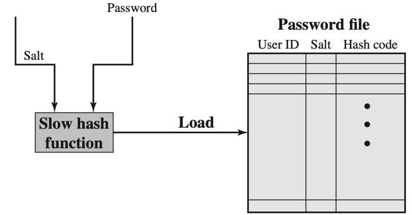
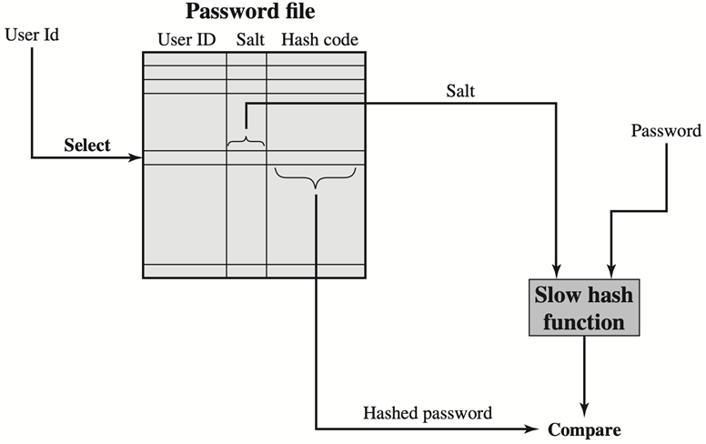
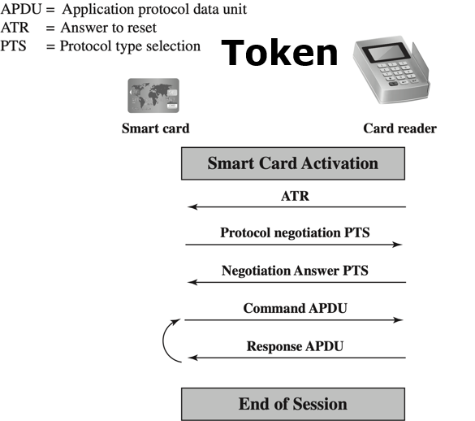
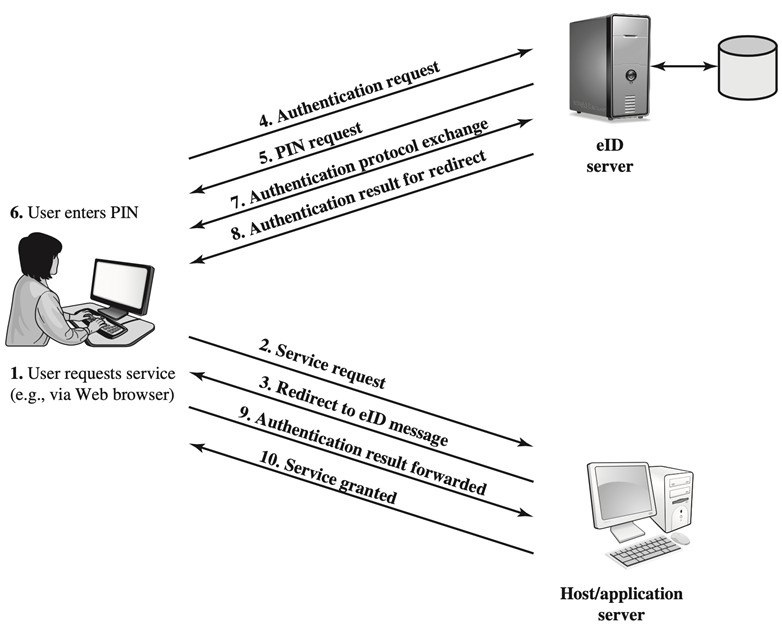
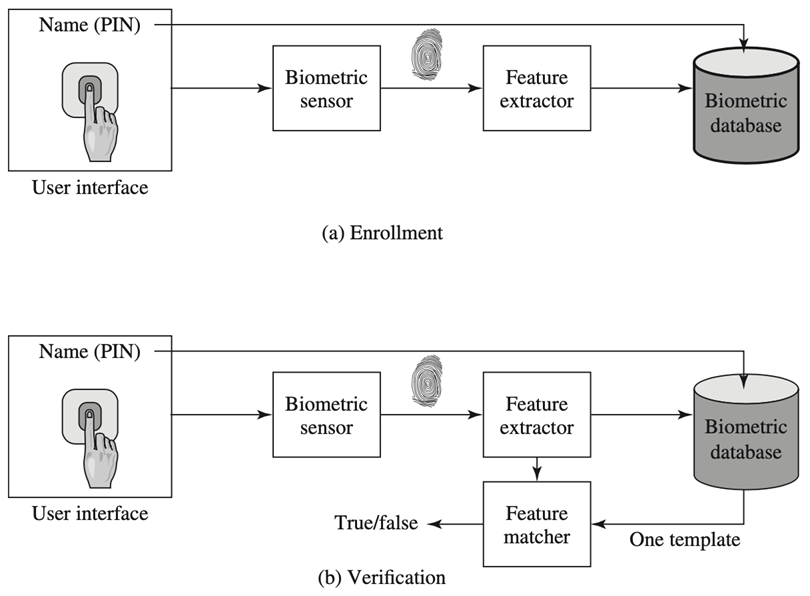

# Network Protection

### firewall

从内到外和从外到内的流量都需要经过防火墙的验证，认证不通过的流量会被阻隔

#### 分布式防火墙

一个独立的防火墙（总控）和多个分布在host上的防火墙一起工作

### IDS

检测具有不寻常特征的流量或将流量与合法用户的流量特征进行匹配，向用户发出警告

### IPS

当检测到不寻常流量时主动拦截，阻止恶意流量

### Honeypot

吸引更多的攻击流量，让攻击者远离关键系统，在蜜罐host上停留更长时间，用来给IDS和IPS提供训练数据

#### Honeywords

在蜜罐环境中给用户的账号创建虚假的密码，然后如果发现有人试图用这个虚假的账号密码登录系统，那就说明有入侵者，进行报警或观察记录流量特征

- 将正确的密码和虚假的存放在同一个hash文件中，当攻击者窃取了这个hash文件，那么他就可能会用这些账号密码去登录
- 攻击者无法分辨哪些账号-密码是虚假的
- 所以攻击行为会被检测到

### password

使用hash+salt

- 在password的明文中随机位数加入一些随机bit，这些随机位数和随机bit被称为salt
- 然后对加盐过的结果进行hash计算，得到hash文件，可以提高hash加密的安全性
  - 防止密码文件中显示重复的密码
  - 大大增加离线字典攻击的难度
    - 暴力破解，但是离线字典不能在服务器端自动加salt，所以不好爆破
  - 大大增加了查明一个人是否在两个或多个系统上使用相同密码的难度

password文件的存储格式：每个UserId有独特的salt用于计算hash

验证的时候

#### 使用Bloom Filter

使用多个hash function，来减少发生冲突的概率

### Load Balancing

将网络流量分配给多个server，以缓解单个server的故障

#### 使用多种分配策略

- Least Connection Method
  - 将流量直接发送到当前活动连接最少的server
- Least Response Time Method
  - 将流量直接发送到具有最少活动连接和最低平均响应时间的服务器
- Round Robin Method
  - 按照顺序将流量分给某个server（这次分给1号，下次就分给2号）
- IP Hash
  - 对ip做Hash，将packet分给ip hash出的server

### 流量清洗 Traffic Scrubbing

使用数据清理服务，对流量进行分析，过滤恶意流量．

此类服务提供者应该配备足够的资源，以承受高容量的traffic flood

一旦攻击被检测到，那就让这个流量进入scrubbing service（清理服务）

- 分析并过滤恶意流量
- 将其中包含的合法流量发给user

### User Authentication 用户认证

识别用户并对用户声称的身份进行验证

Authentication用户的方法

- 使用用户知道的信息
  - password，personal identification number(PIN), 提前准备好的问题的答案
- 使用用户拥有的信息
  - 电子卡，智能卡，物理密钥
- 使用用户“是谁”（唯一辨认）
  - 指纹，脸
- 使用用户的行为
  - 动态生物特征
    - 声音模式、笔迹、打字的节奏

#### Token

用于用户认证的用户拥有的东西

e.g. 电子卡，智能卡，生物ID卡

下图表示：先选择通信协议，然后发送命令

当用户想要访问一个server，那个server需要对用户进行认证，这个认证过程在eID server上实现

#### 生物特征的采集和认证

## Access Control

Access Control与用户认证的区别主要在于，访问控制需要subject、object、access right，这三个主体

- 用户经过认证之后，还需要有对于每种资源的访问权限，才能够访问到某种资源

authorize a subject with some access rights for some objects

一般来说，subject分为owner、group、world。object是资源

### Discreationary Access Control(DAC)

记录权限的不同关联方式

- Access Matrix
  - 构建以object和subject为行列的表格，记录每个object-subject的权限
- ACL Access Control List  资源多的情况
  - 对每个object构建一个链表，记录对它有某种权限的subject的权限
- Capability List        用户多的情况
  - 对每个subject构建一个链表，记录它有某种权限的object的权限

使用的方式根据object/subject的个数来决定

### Role-Based Access Control (RBAC)

基于权限分类，授予不同的身份

根据user的职责（身份），给user设置某种role，赋予role对应的权限

所以在user试图访问时只需要检测user的role，不需要检测user的id

### Attribute-Based Access Control （ABAC）

灵活，前几种都是分配了访问权限之后就固定了。

ABAC基于实时的属性和使用场景划分用户对某资源的访问权限

## Incident Response 不考

周期性活动，不断学习和进步，以发现如何最好地保护组织。

四个主要阶段:准备、检测/分析、控制/根除和恢复

在四个阶段中不断切换反复

